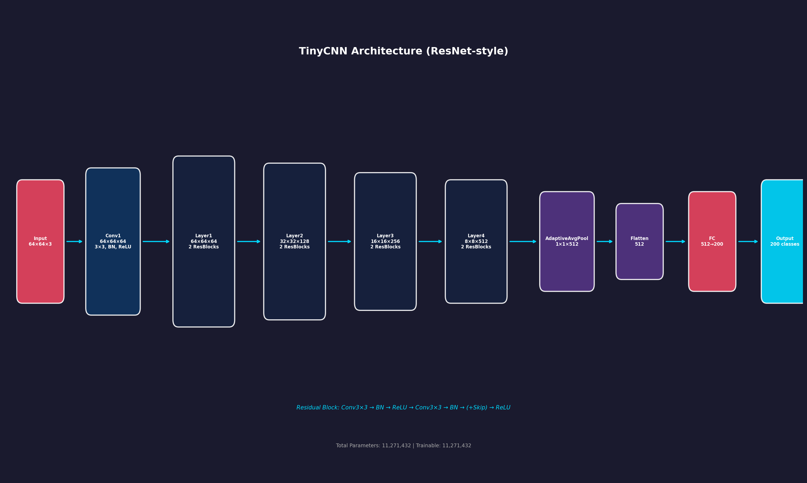
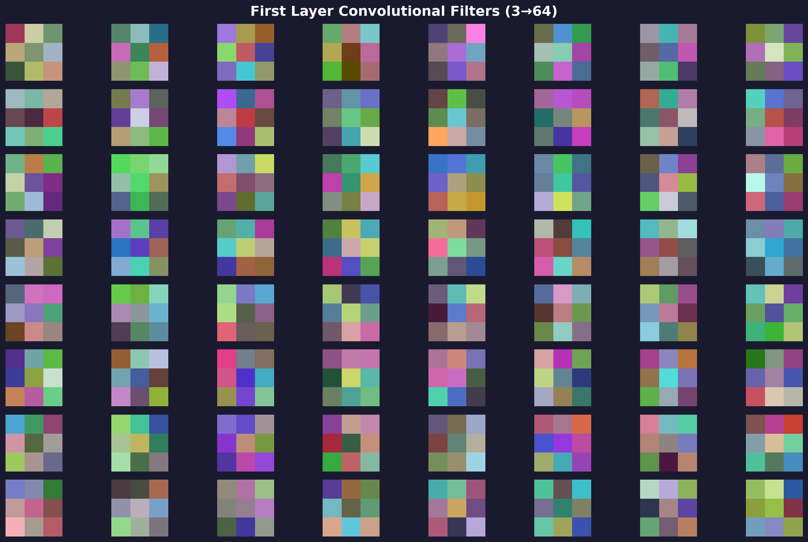
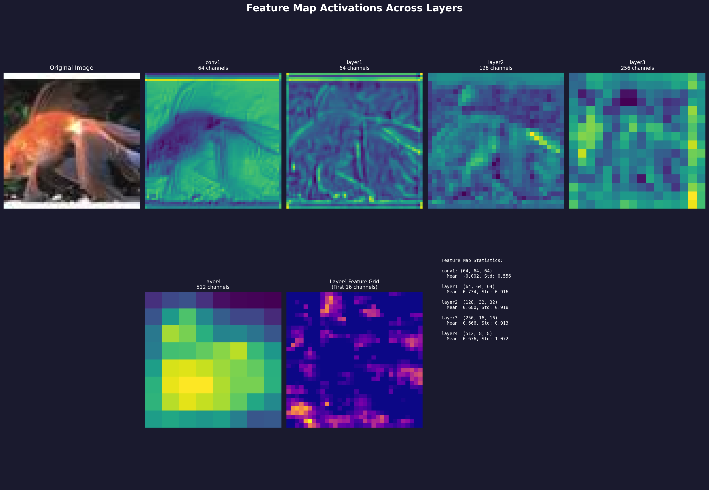
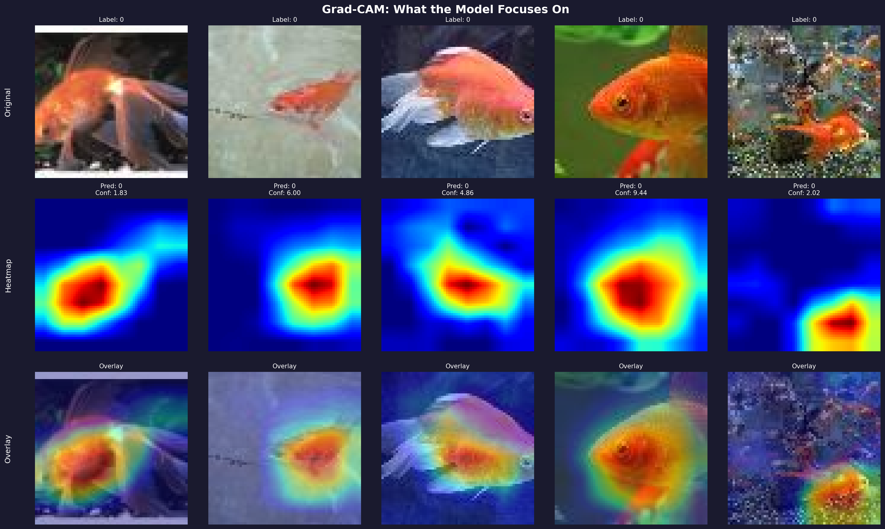

# 🧠 DeepVision Suite
## Comprehensive CNN Image Classification System with Model Interpretability

---

## 📋 Table of Contents
1. [Executive Summary](#executive-summary)
2. [Problem Statement](#problem-statement)
3. [Technical Architecture](#technical-architecture)
4. [Model Design](#model-design)
5. [Training Pipeline](#training-pipeline)
6. [Interpretability Tools](#interpretability-tools)
7. [Deployment Infrastructure](#deployment-infrastructure)
8. [Results & Visualizations](#results--visualizations)
9. [Future Roadmap](#future-roadmap)

---

## Executive Summary

**DeepVision Suite** is a production-ready image classification system built from scratch using PyTorch. The project goes beyond achieving high accuracy—it focuses on **Explainable AI (XAI)** to understand *why* the model makes predictions.

### Key Highlights
| Metric | Value |
|--------|-------|
| **Architecture** | Custom ResNet-style CNN (TinyCNN) |
| **Dataset** | Tiny-ImageNet (200 classes, 100K images) |
| **Parameters** | ~11.2 Million |
| **Input Size** | 64×64 RGB |
| **Inference** | FastAPI REST API |

---

## Problem Statement

### The "Black Box" Problem
Deep learning models are often criticized for being **opaque**—they provide predictions without explaining their reasoning. This creates:
- ❌ Lack of trust in AI systems
- ❌ Difficulty debugging model failures
- ❌ Challenges in regulatory compliance

### Our Solution
DeepVision addresses this through:
- ✅ **Grad-CAM** attention maps showing what the model "looks at"
- ✅ **Feature map visualization** at each layer
- ✅ **Filter visualization** to understand learned patterns
- ✅ **Interactive dashboard** for real-time exploration

---

## Technical Architecture

### System Components

```
┌─────────────────────────────────────────────────────────────────┐
│                        DeepVision Suite                          │
├─────────────────────────────────────────────────────────────────┤
│                                                                   │
│  ┌──────────────┐    ┌──────────────┐    ┌──────────────┐       │
│  │   Training   │    │   Serving    │    │  Dashboard   │       │
│  │   Pipeline   │    │   (FastAPI)  │    │   (Web UI)   │       │
│  └──────┬───────┘    └──────┬───────┘    └──────┬───────┘       │
│         │                   │                   │                │
│         ▼                   ▼                   ▼                │
│  ┌──────────────────────────────────────────────────────┐       │
│  │                    TinyCNN Model                      │       │
│  │            (ResNet-style, 8 Residual Blocks)          │       │
│  └──────────────────────────────────────────────────────┘       │
│                                                                   │
│  ┌──────────────┐    ┌──────────────┐    ┌──────────────┐       │
│  │ Visualization│    │    ONNX      │    │   Docker     │       │
│  │    Suite     │    │   Export     │    │  Container   │       │
│  └──────────────┘    └──────────────┘    └──────────────┘       │
│                                                                   │
└─────────────────────────────────────────────────────────────────┘
```

### Technology Stack

| Component | Technology |
|-----------|------------|
| **Deep Learning** | PyTorch |
| **Data Loading** | HuggingFace Datasets |
| **API Server** | FastAPI + Uvicorn |
| **Visualization** | Matplotlib |
| **Experiment Tracking** | Weights & Biases |
| **Containerization** | Docker |
| **CI/CD** | GitHub Actions |

---

## Model Design

### TinyCNN Architecture

A custom **ResNet-style** architecture optimized for 64×64 images:

```
Input (64×64×3)
    │
    ▼
┌─────────────────────────────────────┐
│  Conv1: 3×3, 64 filters, BN, ReLU   │
└─────────────────────────────────────┘
    │
    ▼
┌─────────────────────────────────────┐
│  Layer1: 2 Residual Blocks (64ch)   │  ← 64×64×64
└─────────────────────────────────────┘
    │
    ▼
┌─────────────────────────────────────┐
│  Layer2: 2 Residual Blocks (128ch)  │  ← 32×32×128 (stride=2)
└─────────────────────────────────────┘
    │
    ▼
┌─────────────────────────────────────┐
│  Layer3: 2 Residual Blocks (256ch)  │  ← 16×16×256 (stride=2)
└─────────────────────────────────────┘
    │
    ▼
┌─────────────────────────────────────┐
│  Layer4: 2 Residual Blocks (512ch)  │  ← 8×8×512 (stride=2)
└─────────────────────────────────────┘
    │
    ▼
┌─────────────────────────────────────┐
│  Adaptive Average Pooling (1×1)     │
└─────────────────────────────────────┘
    │
    ▼
┌─────────────────────────────────────┐
│  Fully Connected: 512 → 200         │
└─────────────────────────────────────┘
    │
    ▼
Output (200 classes)
```

### Residual Block Design

```
Input ─────────────────────────────┐
  │                                │
  ▼                                │ (Skip Connection)
┌───────────┐                      │
│ Conv 3×3  │                      │
└─────┬─────┘                      │
      ▼                            │
┌───────────┐                      │
│ BatchNorm │                      │
└─────┬─────┘                      │
      ▼                            │
┌───────────┐                      │
│   ReLU    │                      │
└─────┬─────┘                      │
      ▼                            │
┌───────────┐                      │
│ Conv 3×3  │                      │
└─────┬─────┘                      │
      ▼                            │
┌───────────┐                      │
│ BatchNorm │                      │
└─────┬─────┘                      │
      │                            │
      └──────────── + ◀────────────┘
                    │
                    ▼
              ┌───────────┐
              │   ReLU    │
              └───────────┘
```

### Why Residual Connections?
- **Prevents vanishing gradients** in deeper networks
- **Enables identity mapping** when needed
- **Improves gradient flow** during backpropagation

---

## Training Pipeline

### Configuration

| Parameter | Value |
|-----------|-------|
| Optimizer | AdamW |
| Learning Rate | 0.001 |
| Weight Decay | 1e-4 |
| Scheduler | Cosine Annealing |
| Batch Size | 64 |
| Epochs | 10 |
| Mixed Precision | Enabled (AMP) |

### Data Augmentation

| Technique | Purpose |
|-----------|---------|
| Random Horizontal Flip | Rotation invariance |
| Random Crop (padding=4) | Translation invariance |
| Color Jitter | Lighting invariance |
| Normalization | ImageNet statistics |

### Early Stopping
- **Patience**: 5 epochs
- **Min Delta**: 0.001
- Saves best model automatically

---

## Interpretability Tools

### 1. Grad-CAM (Gradient-weighted Class Activation Mapping)

**Purpose**: Visualize which parts of the image the model focuses on for predictions.

**How it works**:
1. Forward pass to get predictions
2. Backward pass to compute gradients
3. Weight feature maps by gradient importance
4. Generate heatmap overlay

**Why it matters**: Validates that the model focuses on relevant features, not background noise.

---

### 2. Feature Map Visualization

**Purpose**: Understand how the image is transformed at each layer.

| Layer | What it Captures |
|-------|------------------|
| Conv1 | Edges, colors, basic textures |
| Layer1-2 | Simple patterns, shapes |
| Layer3-4 | Abstract concepts, object parts |

---

### 3. Filter Visualization

**Purpose**: See the raw patterns the first layer learns.

Learned filters typically show:
- Edge detectors (horizontal, vertical, diagonal)
- Color blobs
- Texture patterns

---

## Deployment Infrastructure

### FastAPI Server

```python
# Endpoints
GET  /           # API info
GET  /health     # Health check
POST /predict    # Image classification
GET  /model/info # Model details
```

### Docker Deployment

```dockerfile
FROM python:3.11-slim
WORKDIR /app
COPY requirements.txt .
RUN pip install -r requirements.txt
COPY . .
EXPOSE 8000
CMD ["uvicorn", "serve.app:app", "--host", "0.0.0.0"]
```

### API Response Format

```json
{
  "success": true,
  "prediction": {
    "class_id": 42,
    "confidence": 0.87
  },
  "top5": [
    {"class_id": 42, "confidence": 0.87},
    {"class_id": 15, "confidence": 0.05},
    ...
  ],
  "inference_time_ms": 12.5
}
```

---

## Results & Visualizations

### Architecture Diagram


### Learned Filters (First Layer)


### Feature Map Activations


### Grad-CAM Attention Maps


---

## Interactive Dashboard

A web-based dashboard provides:

| Feature | Description |
|---------|-------------|
| **Overview** | Key statistics and project info |
| **Architecture** | Interactive layer diagram |
| **Visualizations** | Tabbed view of all interpretability tools |
| **Live Inference** | Upload images for real-time classification |
| **Metrics** | Training loss, accuracy, and LR curves |

**Access**: `http://localhost:3000` (run from `/dashboard`)

---

## Future Roadmap

### Phase 1: Architecture Scaling
- [ ] ResNet-50 / EfficientNet support
- [ ] Vision Transformers (ViT)
- [ ] Full ImageNet (224×224)

### Phase 2: Edge Deployment
- [ ] ONNX export ✅
- [ ] TensorRT optimization
- [ ] Mobile deployment (iOS/Android)
- [ ] Sub-10ms inference

### Phase 3: Advanced CV Tasks
- [ ] Object detection backbone (YOLO/Faster R-CNN)
- [ ] Medical imaging fine-tuning
- [ ] Semantic segmentation

### Phase 4: MLOps
- [ ] W&B experiment tracking ✅
- [ ] CI/CD with GitHub Actions ✅
- [ ] Automated retraining pipelines
- [ ] Model versioning

---

## Key Takeaways

| Insight | Explanation |
|---------|-------------|
| 🔄 **Residual Connections** | Critical for training even moderately deep networks |
| 🔬 **Interpretability** | Builds trust and helps debug model failures |
| 🎲 **Data Augmentation** | Essential for preventing overfitting |
| ⚡ **Mixed Precision** | Accelerates training with minimal accuracy loss |

---

## Quick Start Guide

### Training
```bash
python train.py --config configs/train_config.yaml
```

### Visualization
```bash
python visualize_model.py
```

### API Server
```bash
uvicorn serve.app:app --reload --port 8000
```

### Dashboard
```bash
cd dashboard && python -m http.server 3000
```

---

## Project Structure

```
DeepVision-Suite/
├── train.py                 # Training pipeline
├── visualize_model.py       # Visualization suite
├── configs/
│   └── train_config.yaml    # Training configuration
├── serve/
│   ├── app.py              # FastAPI server
│   └── Dockerfile          # Container config
├── dashboard/
│   ├── index.html          # Web dashboard
│   ├── styles.css          # Styling
│   └── script.js           # Interactivity
├── visualizations/          # Generated images
├── tests/                   # Unit tests
└── .github/workflows/       # CI/CD
```

---

## Contact & Resources

- **GitHub**: [Repository Link]
- **W&B Dashboard**: [Experiment Tracking]
- **API Docs**: `http://localhost:8000/docs`

---

<div align="center">

**Built with ❤️ using PyTorch**

`#DeepLearning` `#ComputerVision` `#ExplainableAI` `#PyTorch`

</div>
