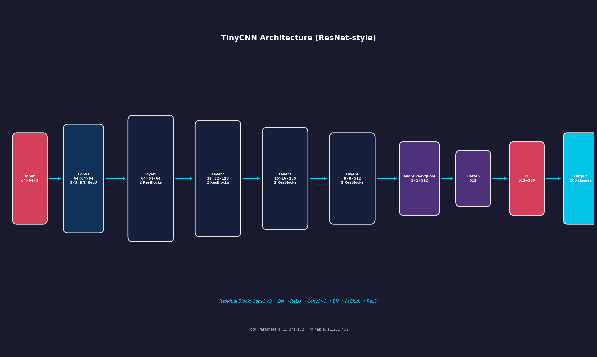
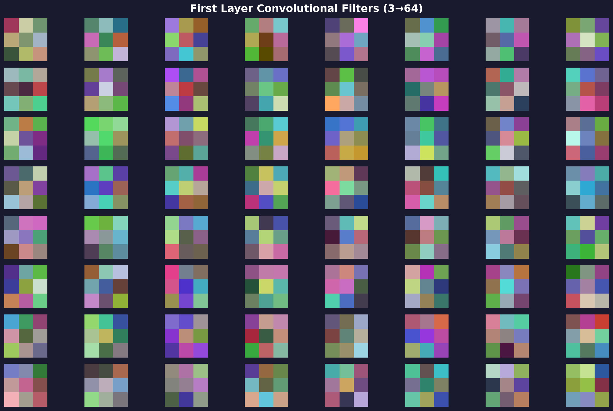
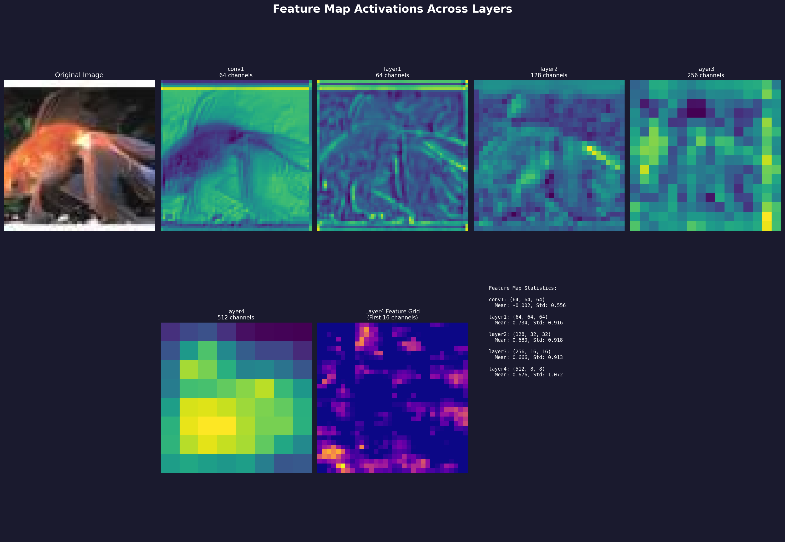
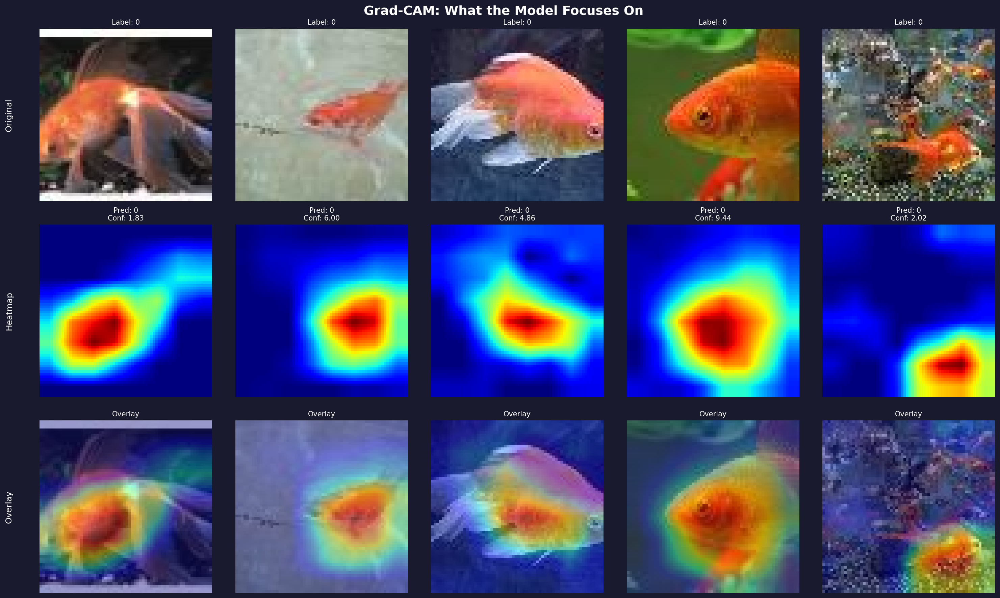

# 🧠 DeepVision: Unlocking the Black Box of CNNs

*> A deep dive into building and interpreting a ResNet-style Convolutional Neural Network on the Tiny-ImageNet dataset.*

---

## 🚀 Project Overview

I built **DeepVision**, a robust image classification system from scratch using **PyTorch**. This project goes beyond just achieving high accuracy; it focuses on **Model Interpretability**—understanding *why* the model makes certain decisions.

Using a custom ResNet-style architecture trained on the **Tiny-ImageNet** dataset (200 classes), I implemented a comprehensive visualization suite to peek inside the "black box" of Deep Learning.

## 🛠️ Tech Stack
- **Core Framework**: PyTorch
- **Architecture**: Custom ResNet (Residual Connections, Batch Norm)
- **Dataset**: Tiny-ImageNet (64x64 images, 200 classes)
- **Visualization**: Matplotlib, Grad-CAM, PCA/Feature Maps
- **Optimization**: AdamW + Cosine Annealing

---

## 👁️ Visualizing the "Brain" of the Model

### 1. The Architecture
Built using residual blocks to prevent vanishing gradients, allowing the network to learn complex features efficiently.

### 2. Learned Filters (First Layer)
These are the raw building blocks the model learns—edges, colors, and textures. It's fascinating to see how they resemble the visual processing in biological eyes!

### 3. Feature Map Activations
As the image passes through the layers, the model abstracts the information. Lower layers capture details, while deeper layers capture high-level concepts (shapes, objects).

### 4. Decision Making with Grad-CAM
Using **Gradient-weighted Class Activation Mapping (Grad-CAM)**, we can see exactly which parts of the image the model focused on to make its prediction. This is crucial for verifying that the model isn't "cheating" by looking at background noise.

---

## 💡 Key Takeaways
- **Residual connections** are critical for training even moderately deep networks effectively.
- **Interpretability tools** like Grad-CAM are essential for building trust in AI systems.
- **Data Augmentation** played a huge role in preventing overfitting on this complex dataset.

## 🔮 Future Scope & Scalability

This project works as a foundational template that can be scaled in several powerful directions:

1.  **Scaling the Architecture**
    *   **Deeper Networks**: The current custom ResNet can be easily swapped for **ResNet-50** or **EfficientNet** to handle full-resolution ImageNet data (224x224).
    *   **Vision Transformers (ViT)**: Implementing Self-Attention mechanisms to capture long-range dependencies in images.

2.  **Deployment & Edge AI**
    *   **Model Serving**: Wrap the model in a **FastAPI** or **TorchServe** container for real-time inference APIs.
    *   **Edge Optimization**: Export to **ONNX** or **TensorRT** (NVIDIA) to run on mobile devices or IoT cameras with sub-10ms latency.

3.  **Advanced Computer Vision Tasks**
    *   **Object Detection**: Use this pre-trained encoder as a backbone for detectors like **YOLO** or **Faster R-CNN** to locate objects, not just classify them.
    *   **Medical Imaging**: Fine-tune the model on X-ray or MRI datasets for automated disease diagnosis assistance.

4.  **MLOps Pipeline**
    *   Integrate **Weights & Biases (W&B)** for experiment tracking.
    *   Set up automated CI/CD pipelines (GitHub Actions) to retrain the model when new data arrives.

---

## 🔗 Code & Resources
Check out the full implementation on my GitHub!
#PyTorch #DeepLearning #ComputerVision #AI #ExplainableAI #DataScience
